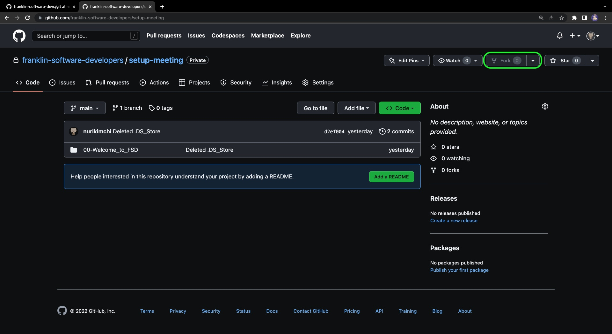
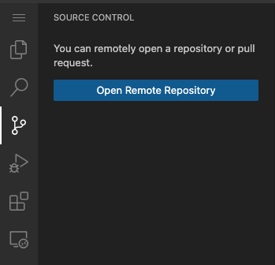
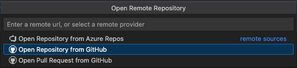
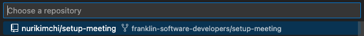
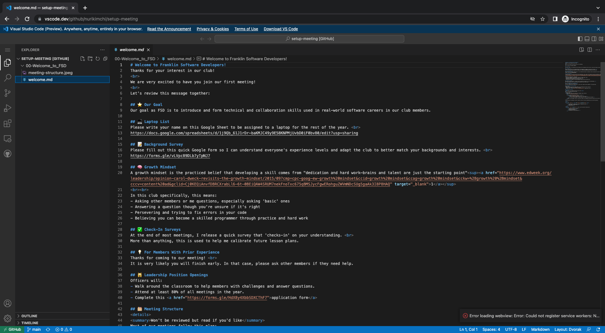
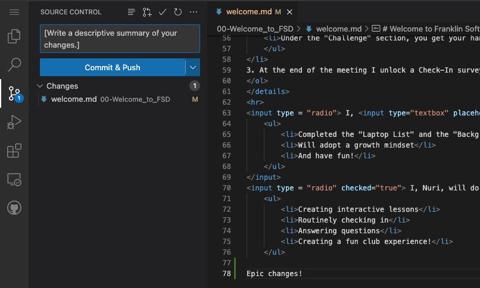

# GitHub
GitHub is a powerful website/application that allows developers to store and share their projects with other users on the web. Users can also track and control past changes in their code.  
All major tech companies (i.e. Airbnb, Netflix, LinkedIn, Facebook) use GitHub or services like it to help manage/track changes in their massive codebases and facilitate multiple developers working on the same feature.

## 🧑‍💻 Making Your GitHub Account
If you already have an account, skip to "Joining the FSD Organization".
<ol>
    <li>Go to <a href="https://github.com/">GitHub</a></li>
    <li>Click on the "Sign up" button at the top right corner</li>
    <li>Enter your <strong>personal email (not your 997 number)</strong></li>
    <li>Enter a secure password</li>
        <ul style="list-style-type: circle">
            <li>Make sure to write it somewhere else so you don't forget!
        </ul>
    <li>Create a somewhat professional username (i.e. nkim)</li>
    <li>Enter the launch code sent to your personal email
</ol>

## 🏘️ Joining the FSD Organization
Joining our GitHub organization gives you access to important repositories (a collection/folder of code) only available to members. 
To join, enter your GitHub username <a href="https://forms.gle/gFyjePmg6KakRA8C9">here</a>. 
In a couple minutes after completing the form, please check your personal email as I probably sent an invitation to join the FSD Organization <strong>or</strong> visit and keep refreshing <a href="https://github.com/franklin-software-developers">our page</a>.

## ⬇️ Forking
Forking is an action that can be done within GitHub. It allows you to copy someone else's repository (coding project). 
Think of making a copy of someone's Google Doc and making your own changes. The changes you make in your copy does not affect the older Google Doc you copied from. 
<strong>In most of our meetings, you will need to fork repositories from our organization and add your changes to it.</strong>

### How to Fork For Meetings?
<ol>
    <li>Go to a repository on our <a href ="https://github.com/franklin-software-developers">organization</a>
        <ul style="list-style-type: circle">
            <li>For this meeting click on the "setup-meeting" repository</li>
        </ul>
    </li>
     
    <li>Click the "Fork" button at the top right
        

            

            
        

    </li>
     
    <li>
        Open VSCode, click on the branch icon on the left, and click "Open Remote Repository":  
        

            

            
        

    </li>
     
    <li>
        It opens a pop-up window, there choose "Open Repository from GitHub":
        

            

            
        

    </li>
     
    <li>
        After, select the repository you just forked (should have a fork icon)
        

            

            
        

    </li>
     
    <li>
        You should then be able to access and change all the files in your new forked repository!
        

            

            
        

    </li>
     
    <li>
        At the end of meetings, save your changes to the web by pressing the "Commit & Push" button.
        

            

            
        

    </li>
</ol>