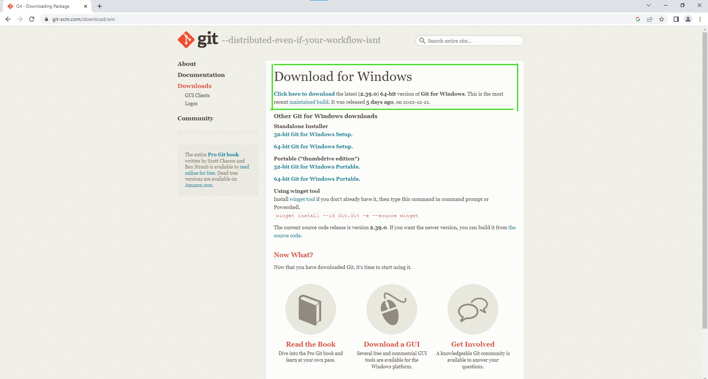

### ***Downloading Git***
<ol>
    <li>Visit Git's official <a href="https://git-scm.com/download/win">website</a></li>
    <li>

Click the top link to download the latest version of Windows

</li>
    <li>Open the new <code>.exe</code> file at the bottom
    <li>

You'll be taken to a window to setup Git, click next until you reach "Choosing the default editor..."

 
    <li>Choose "Visual Studio Code"</li>
    <li>After, click "Next" until it starts installing, then "Finish"</li>
</ol> 

### ***Configuring Git***
<ol>
    <li>Open Ubuntu</li>
    <li><code>git config --global user.name "first and last name registered on GitHub"</code></li>
    <li><code>git config --global user.email "your GitHub email"</code></li>
</ol>