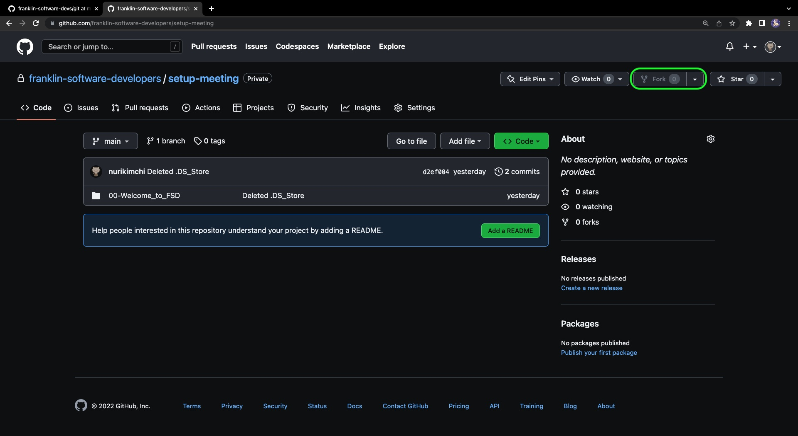
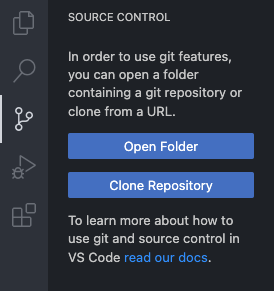
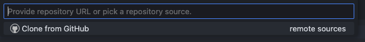
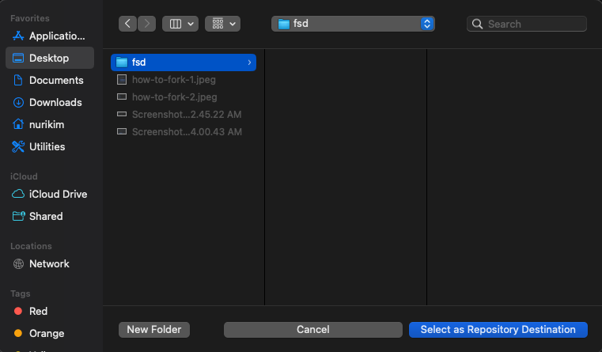
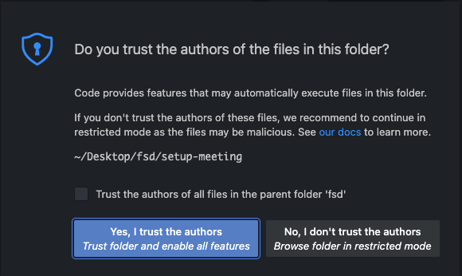
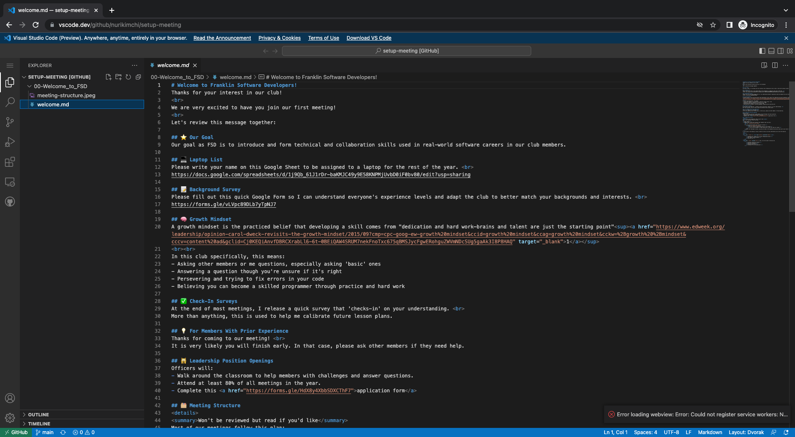
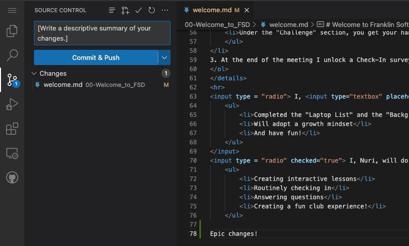

## ⬇️ Forking
Forking is an action that can be done within GitHub. It allows you to copy someone else's repository (coding project). 
Think of making a copy of someone's Google Doc and making your own changes. The changes you make in your copy does not affect the older Google Doc you copied from. 
<strong>In most of our meetings, you will need to fork repositories from our organization and add your changes to it.</strong>

### How to Fork For Meetings?
<ol>
    <li>Go to a repository on our <a href ="https://github.com/franklin-software-developers">organization</a>
        <ul style="list-style-type: circle">
            <li>For this meeting click on the "setup-meeting" repository</li>
        </ul>
    </li>
     
    <li>Click the "Fork" button at the top right
        

            

            
        

    </li>
     
    <li>
        Open VSCode, click on the branch icon on the left, and click "Clone Repository": 
        

            

            
        

    </li>
     
    <li>
        It opens a pop-up window, there choose "Open Repository from GitHub":
        

            

            
        

    </li>
     
    <li>
        You'll get another window that asks you where to store your cloned repository, select the 'fsd' folder you just created:
        

            

            
        

    </li>
     
    <li>
        If you see another pop-up like this, choose to "Yes, I trust the authors":
        

            

            
        

    </li>
     
    <li>
        You should then be able to access and change all the files in your new forked repository!
        

            

            
        

    </li>
     
    <li>
        At the end of meetings, save your changes to the web by pressing the "Commit & Push" button.
        

            

            
        

    </li>
</ol>