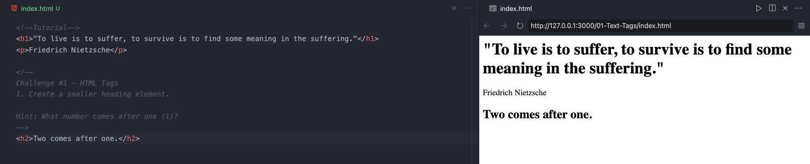

# **Welcome to Franklin Software Developers!**
Thanks for your interest in our club!
 
We are very excited to have you join our first meeting!
 
Let's review this message together:

## ⭐️ **Our Goal**
Our goal as FSD is to introduce and form technical and collaboration skills used in real-world software careers in our club members.

## 💻 **Laptop List**
Please write your name on this <a href="https://docs.google.com/spreadsheets/d/1j9Qb_61J1rDr-baKMJC49y9E58KNPMjUvbD0iF0bv80/edit?usp=sharing" target="_blank">Google Sheet</a> to be assigned to a laptop for the rest of the year.  

## 📝 **Background Survey**
Please fill out this quick <a href="https://forms.gle/M1MpTCQPYNCbwexq8" target="_blank">Google Form</a> so I can understand everyone's experience levels and adapt the club to better match your backgrounds and interests.  

## 🧠 **Growth Mindset**
A growth mindset is the practiced belief that developing a skill comes from "dedication and hard work—brains and talent are just the starting point"<a href="https://www.edweek.org/leadership/opinion-carol-dweck-revisits-the-growth-mindset/2015/09?cmp=cpc-goog-ew-growth%20mindset&ccid=growth%20mindset&ccag=growth%20mindset&cckw=%2Bgrowth%20%2Bmindset&cccv=content%20ad&gclid=Cj0KEQiAnvfDBRCXrabLl6-6t-0BEiQAW4SRUM7nekFnoTxc675qBMSJycFgwERohguZWVmNDcSUg5gaAk3I8P8HAQ" target="_blank">1</a>
  
In this club specifically, this means:
- Asking other members or me questions, especially asking 'basic' ones
- Answering a question though you're unsure if it's right
- Persevering and trying to fix errors in your code
- Believing you can become a skilled programmer through practice and hard work

## ✅ **Check-In Surveys**
At the end of most meetings, I release a quick survey that 'checks-in' on your understanding.  
More than anything, this is used to help me calibrate future lesson plans.

## 💡 **For Members With Prior Experience**
Thanks for coming to our meeting!  
It is very likely you will finish early. In that case, please ask other members if they need help.

## 🙀 **Leadership Position Openings**
Officers will: 
- Walk around the classroom to help members with challenges and answer questions.
- Attend at least 80% of all meetings in the year.
- Complete this <a href="https://forms.gle/9pUaAzYT1GjmfkLk9" target="_blank">application form</a>

## 🗂️ **Meeting Structure**

Won't be reviewed but if you'd like to preview:

Most of our meetings follow this plan: 
<ol> 
<li>Open laptops</li>
<li>Members get a prewritten document that somewhat looks like this:
    
    <ul>
    <li>I live code and explain the "Tutorial" section</li>
        <ul style=“list-style-type:square”>
            <li>You can choose to code along with me or just watch</li>
            <li>I will also ask members to make predictions on what the code will output</li>
        </ul>
    <li>Under the "Challenge" section, you get your hands on the keyboard and practice what you've just learn</li>
    </ul>
</li>
1. At the end of the meeting I unlock a Check-In survey to see how comfortable you are with the material
</ol>

## 🤝 **Completely Informal Agreement**
<input type = "radio"> I, <input type="textbox" placeholder="Name"></input>, 
    <ul>
        <li>Completed the "Laptop List" and the "Background Survey"</li>
        <li>Will adopt a growth mindset</li>
        <li>And have fun!</li>
    </ul>
</input>
<input type = "radio" checked="true"> I, Nuri, will do my best to help you by
    <ul>
        <li>Creating interactive lessons</li>
        <li>Routinely checking in</li>
        <li>Answering questions</li>
        <li>Creating a fun club experience!</li>
    </ul>