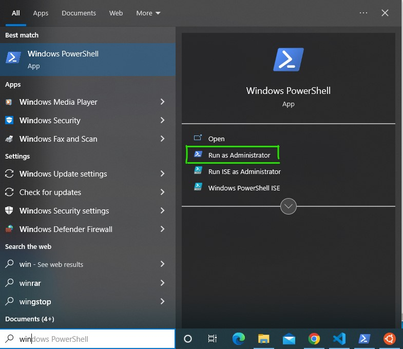

# 📩 **Installation**
We will be downloading important tools to help setup our development environment (a workspace made of software applications that help us develop an app).

## **＞ Command Line Interface (CLI)**
The command line interface is a text-based program that runs on computers. Instead of using your mouse to point and click at graphic icons, use the CLI to type only a couple keywords to accomplish the same (and even more) actions in a fraction of the time.  
Here are some actions the CLI can do faster and easier:

    
Navigating and creating folders and files

    

    
Opening existing applications

    

<li>Downloading software</li>
<li>Interacting with GitHub repositories</li>
 

*Using the CLI increases our productivity as developers.*
 

## 🐧 **WSL**
WSL is a CLI app offered by Microsoft that allows you to run Linux commands on a Windows computer.

    
What is Linux?

    Windows and MacOS are both operating systems, the essential software that manages the computer's software and hardware. Like Windows and MacOS, Linux is another operating system (OS). However, Linux is an open-source OS, meaning its users can freely access, redistribute and modify it, a huge reason it rose in popularity.

### ***Downloading WSL***
<ol>
    <li>
        

            
"Run [Windows PowerShell] as Administrator"

            
        

    </li>
    <li>Once open type this command:  <code>wsl --install -d Ubuntu</code></li>
    <li>Wait through installation:</li>
        <ul style="list-style-type: circle">
            <li>
            

                
Installation process should look like this:

                
            

            </li>
        </ul>
    <li>Once completed, a new Ubuntu window will open asking for your username</li>
        <ul style="list-style-type: circle">
            <li>
                Username should follow structure like <code>nurikim</code> (full name, no spaces, no capitals)
            </li>
        </ul>
    <li>Then, it asks for your password which for everyone, is <code>ict</code></li>
        <ul style="list-style-type: circle">
            <li>
                

                    
<strong>The characters will not show as you type; just press enter after writing <code>ict</code></strong>

                    
                

            </li>
        </ul>
    <li>
        

            
If installed properly, you should see this line:

            <ul style="list-style-type: circle">
                
            </ul>
        

    </li>
</ol>

### ***Using WSL to Download Packages***
Copy and paste this command in WSL and press enter:   
<code>sudo apt update && sudo apt upgrade && sudo apt install nodejs && sudo apt install npm</code> 

    
<strong>Optional</strong>: Reveal to find what each part of the command means. 

<ul>
<li><code>&&</code>: After running the command on the left, run the command on the right.</li>

<li><code>apt</code>:
    Calls Advanced Package Tool (APT), a collection of repositories that hold software packages.</li>

<li><code>sudo apt update</code>: 
    Browses through a list of packages on <code>apt</code> and copies the latest version of each package onto the computer.</li>

<li><code>sudo apt upgrade</code>:
    Upgrades all <code>apt</code> packages that are currently stored on the computer.</li>

<li>
<code>sudo apt install nodejs</code>:
    <ul>
        <li>As a superuser (<code>sudo</code>) <code>install</code> <code>nodejs</code> (package name) from a list of packages held by <code>apt</code> </li> 
    </ul>
</li>

<li>Not in the command but useful to know: <code>[package name] -v</code>:
    <ul>
        <li><code>-v</code> asks the computer to display the package's version</li>
        <li>If running the command does not display its version number, it's telling you the package has not been installed yet
    </ul>
</li>
</ul>

 

### ***Installing the WSL VSCode Extension***
Extensions are software add-ons that can be added to your development environment on VSCode. These often enhance your productivity as a developer through added support for programming languages, debuggers, code formatters, 
 

## 👩‍💻 **VSCode**
VSCode is an IDE (integrated development environment) application which essentially helps developers edit, run, and commit their code to GitHub. Think of Google Docs but for code.

### ***Correctly Opening VSCode***
We need to open VSCode through the command line so we can implement Git into our project.

    
What is Git?

    Git is a piece of open-source software that tracks changes in code files and allows collaboration between developers working on the same project. 
    GitHub, as we covered earlier, is designed around Git.

<ol>
    <li>Open Windows PowerShell normally (do not "Run as administrator")</li>
    <li>
        

            
<code>wsl</code>

            Open WSL
        

    </li>
    <li>
        

            
<code>cd Desktop</code>

            <ul>
                <li><code>cd</code>: Change directories (go into the specified folder)</li>
                <li><code>Desktop</code>: Change directories into your computer's Desktop to access its files, folders, or apps
            </ul>
        

    </li>
    <li>
        

            
<code>ls</code>

            List everything (i.e. files, folders, apps, etc.) that is in your current directory/folder
        

    </li>
    <li>
        

            
<code>cd fsd</code>

            Change into/open the <code>fsd</code> folder that is on your Desktop
        

    </li>
    <li>
        

            
<code>code [repository/folder name]</code>

            <ul>
                <li><code>code</code>: Open the specified repository/folder on your computer with VSCode</li>
            </ul>
        
    
    </li>
</ol>